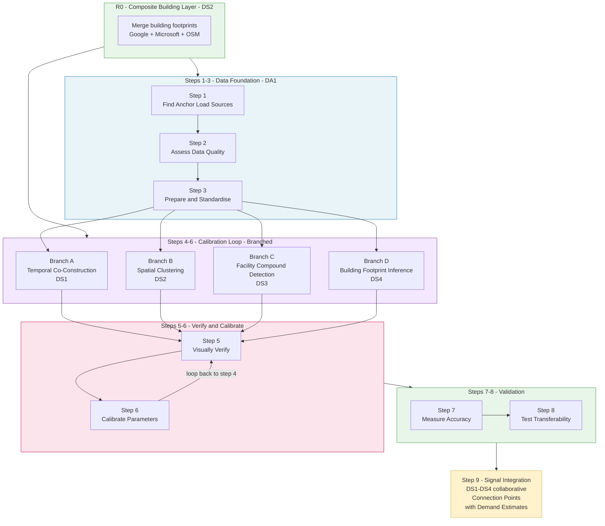

# Project Pipeline — From Raw Data to Connection Points

| | |
|---|---|
| **Document** | Project Pipeline — From Raw Data to Connection Points |
| **Audience** | RMIT WIL Capstone Students (DA1, DS1–DS4) |
| **Semester** | 2026 Semester 1 |
| **Last Updated** | 2026-03-17 |
| **Status** | Draft |
| **Distribution** | Restricted — participating students and RMIT staff only. Do not share externally. |

## Introduction

Prodegee is building a pipeline that answers one question: **which buildings in the Global South share a single electricity connection?** The answer — called a *connection point* — combines a group of buildings with an estimate of their aggregate electricity demand. Getting this right matters because electricity utilities, rural electrification planners, and development organisations need accurate demand estimates at the connection level, and today's data does not provide them.

The problem is hard because there is no single dataset that tells you which buildings belong together. Instead, the pipeline assembles multiple independent evidence signals — spatial proximity, construction timing, facility registries, building footprints — and combines them. Each of the five teams contributes one or more of these signals:

- **DA1** — Data Discovery and Calibration
- **DS1** — Temporal Co-Construction Patterns
- **DS2** — Spatial Clustering and Community Detection
- **DS3** — Facility Compound Detection
- **DS4** — Building Footprint Inference

These codes match the team directories under `docs/2-teams/` in the repository.

This document describes the end-to-end pipeline that your teams contribute to. It is organised in four parts:

1. **Step Descriptions** — What each pipeline step does, what it produces, and which team owns it
2. **Pipeline Overview** — A visual diagram showing how the steps connect
3. **Key Concepts** — Flow maturity stages, hackathons, and other concepts referenced in the work plan
4. **Work Plan** — Week-by-week assignments, deadlines, and detailed descriptions of what each team does

The pipeline starts with a shared upstream (*Steps 1–3*), branches into parallel evidence signals (*Steps 4–6*), and converges at signal integration (*Step 9*).

## Step Descriptions

### R0: Composite Building Layer (DS2)

Before any detection or clustering can happen, the pipeline needs a complete building layer. Three global sources provide building footprints — Google Open Buildings, Microsoft Building Footprints, and OpenStreetMap — but each has gaps in different areas and represents buildings with different geometric conventions. DS2 merges these into one deduplicated composite layer per country: geometric matching across sources, overlap resolution, and deduplication. This composite layer becomes the shared input that all other teams run their algorithms against. Without it, every team would be working on incomplete data and missing buildings that only appear in one source.

### Steps 1–3: Data Foundation (DA1)

DA1 repeats these three steps for every new combination of entity type and country.

**Step 1. Find Anchor Load Sources** — Identify geolocated facility datasets (government registries, NGO datasets, HDX, OSM, EMIS/DHIS2) for a given entity type and country. An anchor load is a known facility — school, health centre, market, telecom tower, water point, government building, agricultural facility — with higher electricity demand that anchors the demand estimate for a cluster of buildings.

**Step 2. Assess Data Quality** — Evaluate geocoding accuracy, completeness, attribute richness, and licensing. Determine whether the source is usable or needs too much correction.

**Step 3. Prepare and Standardise the Dataset** — Transform the raw facility data into the format the pipeline expects: standardise coordinates to WGS84, normalise entity type labels to a common taxonomy (e.g., "dispensary"/"clinic"/"health post" → "health_centre"), clean and flag problematic coordinates (centroids, 0,0, ocean), map source-specific attribute columns to the pipeline schema, and deduplicate against datasets already ingested. Output a clean dataset ready for the Kestra flows to consume.

### Steps 4–6: The Calibration Loop (Branched)

After step 3, the pipeline branches. Each branch uses a different evidence signal to identify which buildings belong together. All branches follow the same verify-calibrate loop (steps 5–6) but with different inputs and detection logic.

- **Branch A — Temporal Co-Construction (DS1)** — Use building footprint sources that include temporal data (currently the Google Open Buildings 2.5D Temporal Dataset) to detect construction cohorts — groups of buildings that appeared within the same time window in satellite imagery. Buildings constructed together likely belong to the same compound. Train an AI model to predict co-construction probability from building features alone, extending the signal to regions where temporal data is unavailable.

- **Branch B — Spatial Clustering (DS2)** — Build proximity graphs (nodes = buildings, edges = spatial relationships) and apply graph-based community detection algorithms (HDBSCAN, Louvain, spectral clustering) to identify natural building clusters. Train an AI model to recognise cluster-like spatial arrangements beyond simple distance thresholds.

- **Branch C — Facility Compound Detection (DS3)** — Take each known facility point from step 3, match it to surrounding buildings from the composite building layer, and apply spatial rules (size thresholds, buffer distances, road barriers, BFS flood-fill) to identify which buildings constitute that facility's compound. Then analyse the spatial signatures of these known compounds by facility type — school compounds look different from market compounds. Train an AI model to recognise facility-like spatial arrangements without labelled data, extending detection to areas where no facility registry exists.

- **Branch D — Building Footprint Inference (DS4)** — Classify building use from footprint characteristics — area, aspect ratio, shape complexity, proximity to roads, relative size within clusters. A large rectangular building is likely institutional; a small square structure near a larger building is likely an ancillary outbuilding that should not be counted as a separate connection.

**Step 5. Visually Verify Against Satellite Imagery** — In QGIS, overlay the algorithm's building selections on satellite imagery. Check whether the identified buildings actually belong together.

**Step 6. Calibrate Existing Parameters and Identify New Ones** — Adjust parameters based on what the visual verification reveals. Where existing variables aren't sufficient, identify new ones to add. Return to step 4.

### Steps 7–8: Validation (All Branches)

**Step 7. Measure Accuracy** — Calculate precision, recall, and F1 (the harmonic mean of precision and recall — a single score that balances both) against validation data. This quantifies what the visual verification shows qualitatively.

**Step 8. Test Cross-Regional Transferability** — Apply the calibrated parameters to other countries. Where they fail, identify the natural boundaries of calibration — geographic, sectoral, settlement density — that define where parameter values need to diverge in the fractal hierarchy.

### Step 9: Signal Integration (DS1–DS4 Collaborative)

The four evidence signals from the branches converge here. This is the step that solves the Fiji Problem — determining which buildings share a single electricity connection.

| Signal | Source | What It Tells Us |
|--------|--------|-----------------|
| Temporal co-construction | DS1 (Branch A) | Which buildings were constructed together |
| Spatial clusters | DS2 (Branch B) | Which buildings form natural groups |
| Facility compounds | DS3 (Branch C) | Which buildings belong to known or inferred facilities |
| Building use classification | DS4 (Branch D) | Which buildings are ancillary vs. independent |

The integration algorithm must combine signals of different types and reliability levels, degrade gracefully when some signals are missing, produce pairwise connection probabilities, apply graph-based community detection to group buildings into connection points, calculate diversity factors, and output **connection points with aggregate demand estimates**.

---

## Pipeline Overview

---

## Key Concepts

### Kestra

Kestra is an open-source workflow orchestration platform that Prodegee uses to automate data processing pipelines. A Kestra *flow* defines a sequence of tasks — fetching data, transforming it, validating outputs, storing results — that runs automatically on a trigger (a schedule, an event, or a manual request). Instead of running scripts manually on your laptop, you define the workflow once as a flow, and Kestra handles execution, retries, logging, and scheduling. Key advantages that led Prodegee to select Kestra:

- **Declarative YAML**: Flows are defined in YAML files, which means they live in Git alongside your code — version-controlled, reviewable, and auditable
- **Polyglot**: Tasks within a flow can run in any language such as Python, Go, TypeScript, or Rust — you are not locked into one language
- **AI-friendly**: The declarative structure means Claude Code can read, write, and modify flows directly, accelerating development
- **Audit-ready**: Every execution is logged with inputs, outputs, and timing — critical for reproducibility in research

All teams will build Kestra flows as the primary way to operationalise their work. Prodegee has trained Claude Code with Kestra-specific knowledge, conventions, and gotchas, so it can assist you effectively when writing, debugging, and deploying flows.

### Flow Maturity Stages

Prodegee defines three maturity stages that describe how flows evolve:

- **Stage 1 — Hardcoded scripts**: Write individual scripts that each solve one specific problem. All parameters — source URLs, column mappings, thresholds, coordinate formats — are hardcoded for a single use case. The goal is working code that produces correct results, even if every dataset or scenario needs its own script. This is where you learn what works.

- **Stage 2 — Configurable flows**: Consolidate those per-case scripts into one (or a few) Kestra flows that read their parameters from a JSON configuration file. Instead of writing new code for each case, you add a new entry to the configuration. The same flow handles different datasets, entity types, or regions by reading their configuration. When source data is updated, the flow can reprocess it automatically without code changes.

- **Stage 3 — Intelligent flows**: The flow can handle a case it has never seen before — without anyone writing a configuration entry first. It uses AI to figure out what it needs: for DA1, that might mean inferring that a column called `nom_ecole` means "school name" or that coordinates are in degrees-minutes-seconds; for DS teams, it might mean recognising spatial patterns in a new region without re-calibrating parameters. This is a stretch goal — not all teams will reach it, and that is fine.

The progression from *Stage 1* to *Stage 2* is expected for all teams. *Stage 3* is aspirational — not all teams will reach it, and that is fine.

What *Stage 3* looks like varies by team:

- **DA1**: The flow infers column mappings and data schemas from previously unseen datasets
- **DS1**: The model predicts co-construction probability from building features alone
- **DS2**: The model recognises cluster patterns without manually set distance thresholds
- **DS3**: The model detects facility compounds without labelled training data
- **DS4**: The model classifies building use without manually calibrated feature weights

### Hackathons

Two in-person hackathons are scheduled during the semester. These are intensive collaborative events where students work together alonsgide Prodegee staff.

**Hackathon 1 — Pipeline Kickoff Sprint (Week 5, 30 Mar – 5 Apr)**

Hackathon 1 is expected to take place during the first week of hands-on data work, when Prodegee staff are in Melbourne. The purpose is cross-team orientation: every team sees how their work connects to the others in the pipeline, meets members from other projects, and begins their first data exploration in a collaborative setting. This is deliberately early — before teams disappear into their own branches for several weeks. Understanding how your output feeds into someone else's input changes how you approach your own work.

**Hackathon 2 — Integration and *Stage 3* Workshop (Week 11, 18–24 May)**

Hackathon 2 takes place during Prodegee staff's second Melbourne visit, when teams have completed their *Stage 2* work and are preparing final deliverables. For DS teams, this is the signal integration workshop (*Step 9*) — bringing together the five evidence signals from different branches and experimenting with how to combine them. For DA1, this is the *Stage 3* push — testing whether flows can handle previously unseen data without manual configuration. The timing gives teams one full week (week 12) to incorporate hackathon insights into their final deliverables before presentations begin.

---

## Work Plan

### How Assignments Work

Each week, your team works on one *team assignment* (TA). Each assignment has a lider, who rotates on a weekly basis. Assignments follow a kanban flow described in `docs/1-getting-started/assignment-guide.md`:

1. **Backlog**: Prodegee posts next week's assignment to `1-backlog/`. While there, your team and supervisor can comment on it — questions, suggestions, concerns — via files in `5-workspace/{assignment-id}/comments/`. This is done with the assistance of Claude Code, who knows the procedure and will guide you through it.
2. **Ready**: Every Monday, before 8 am, Prodegee reviews comments and moves the assignment to `2-ready/` when fully specified, while also posting the assignment for the following week in `1-backlog/` for your team to comment on.
3. **In progress**: Your assignment leader moves it to `3-in-progress/` and the team executes the jobs. Each assignment consists of jobs, with each job consisting of a series of work items organised either sequentially or in parallel.
4. **Done**: When all acceptance criteria are met, the assignment leader's Claude Code instance moves it to `4-done/`.

Assignments are due by the end of the week they are worked on. While you work on the current week's assignment, the next week's assignment is already visible in backlog for you to review and comment.

### Weekly Overview

All teams start on existing data. RMIT assessment deadlines are shown in **bold**.

| Week | Dates | DA1 | DS1 | DS2 | DS3 | DS4 |
|------|-------|-----|-----|-----|-----|-----|
| 1 | 2–6 Mar | Course intro, WIL allocation | Course intro, WIL allocation | Course intro, WIL allocation | Course intro, WIL allocation | Course intro, WIL allocation |
| 2 | 9–13 Mar | Course intro, WIL allocation | Course intro, WIL allocation | Course intro, WIL allocation | Course intro, WIL allocation | Course intro, WIL allocation |
| 3 | 16–22 Mar | Kick-off (Mon 16 Mar 4:30 PM). Onboarding: tools, repo, pipeline overview. **Project Preparation due 22 Mar** | Kick-off (Wed 18 Mar 11:00 AM). Onboarding: tools, repo, pipeline overview | Kick-off (Mon 16 Mar 2:00 PM). Onboarding: tools, repo, pipeline overview | Kick-off (Wed 18 Mar 12:30 PM). Onboarding: tools, repo, pipeline overview | Kick-off (Thu 19 Mar 11:00 AM). Onboarding: tools, repo, pipeline overview |
| 4 | 23–29 Mar | Literature review (all 3 jobs) | Literature review (all 3 jobs) | Literature review (all 3 jobs) + R0 data acquisition: download building footprint sources | Literature review (all 3 jobs) | Literature review (all 3 jobs) |
| 5 | 30 Mar–5 Apr | **Hackathon 1** (all projects). **Initial Reflection Interview**. *Steps 1–2*: Broad data source discovery and quality assessment across Global South countries | **Hackathon 1** (all projects). Explore building footprint sources with temporal data. Identify construction cohorts in existing data. **Project Proposal due 2 Apr** | **Hackathon 1** (all projects). R0: Explore three building footprint sources (Google Open Buildings, Microsoft Building Footprints, OSM). Assess gaps and overlaps. **Project Proposal due 2 Apr** | **Hackathon 1** (all projects). Explore existing compound detection outputs. Analyse spatial signatures. **Project Proposal due 2 Apr** | **Hackathon 1** (all projects). Explore building footprint features in existing data. Feature engineering: area, aspect ratio, shape complexity. **Project Proposal due 2 Apr** |
| Break | 3–12 Apr | Mid-semester break. **Project Proposal due 12 Apr** | Mid-semester break | Mid-semester break | Mid-semester break | Mid-semester break |
| 6 | 13–19 Apr | *Step 3* (*Stage 1*): Build wrangling and standardisation scripts for priority datasets identified in week 5 | *Stage 1*: Run temporal analysis on existing data. Identify co-construction patterns by settlement density | R0: Build composite building layer — geometric matching, overlap resolution, deduplication across three sources. Output layer becomes shared input for all teams | *Stage 1*: Run compound detection on existing data (parallel with DA1). Calibrate size/buffer parameters | *Stage 1*: Train initial classifier on existing labelled buildings. Test residential vs. institutional vs. ancillary |
| 7 | 20–26 Apr | *Step 3* (*Stage 2*): Consolidate per-dataset scripts into configurable Kestra flow(s) driven by JSON configuration | *Stage 1*: Calibrate time-window parameters. Verify cohorts visually (*Step 5*). Adjust thresholds (*Step 6*) | *Stage 1*: Build proximity graphs on composite layer. Test HDBSCAN, Louvain, spectral clustering. Calibrate distance thresholds (*Steps 5–6*) | *Stage 1*: Calibrate detection for markets and government buildings. Verify visually (*Step 5*). Adjust (*Step 6*) | *Stage 1*: Calibrate classification thresholds. Verify visually (*Step 5*). Adjust features (*Step 6*) |
| 8 | 27 Apr–3 May | *Step 3* (*Stage 2*): Build automated update mechanisms — email triggers and cron schedules. Validate configurable flow across all datasets. Prepare for mid-presentation | *Stage 1*: Continue calibration loop. Measure P/R/F1 (*Step 7*) | *Stage 1*: Continue calibration loop. Measure P/R/F1 (*Step 7*) | *Stage 1*: Continue calibration loop. Measure P/R/F1 (*Step 7*) | *Stage 1*: Continue calibration loop. Measure P/R/F1 (*Step 7*) |
| 9 | 4–10 May | **Mid-Project Presentation + Reflection Interview**. *Stage 2* validation: test flow reprocessing when datasets are updated | Test transferability to new regions (*Step 8*). Begin *Stage 2*: train AI model on *Stage 1* labels | Test transferability to new regions (*Step 8*). Begin *Stage 2*: train AI model on *Stage 1* labels | Test transferability to new regions (*Step 8*). Begin *Stage 2*: train AI model on *Stage 1* labels | Test transferability to new regions (*Step 8*). Begin *Stage 2*: train AI model on *Stage 1* labels |
| 10 | 11–17 May | *Stage 3* exploration: can the flow process new, previously unseen datasets without manual configuration? | *Stage 2*: Train and validate AI model. Evaluate on held-out regions | *Stage 2*: Train and validate AI model. Evaluate on held-out regions | *Stage 2*: Train and validate AI model. Evaluate on held-out regions | *Stage 2*: Train and validate AI model. Evaluate on held-out regions |
| 11 | 18–24 May | **Hackathon 2** (all projects). *Stage 3* testing and refinement. Data source catalogue. Prepare final deliverables | **Hackathon 2** (all projects). *Stage 2*: Cross-regional validation. *Step 9*: Signal integration workshop | **Hackathon 2** (all projects). *Stage 2*: Cross-regional validation. *Step 9*: Signal integration workshop | **Hackathon 2** (all projects). *Stage 2*: Cross-regional validation. *Step 9*: Signal integration workshop | **Hackathon 2** (all projects). *Stage 2*: Cross-regional validation. *Step 9*: Signal integration workshop |
| 12 | 25–31 May | Final deliverables: configurable Kestra flows, data source catalogue, validation reports | Incorporate hackathon insights. Finalise *Stage 2* model and report | Incorporate hackathon insights. Finalise *Stage 2* model and report | Incorporate hackathon insights. Finalise *Stage 2* model and report | Incorporate hackathon insights. Finalise *Stage 2* model and report |
| 13 | 1–7 Jun | **Final Presentation** (week of 1 Jun) | **Final Report due 6 Jun. Slides due 7 Jun** | **Final Report due 6 Jun. Slides due 7 Jun** | **Final Report due 6 Jun. Slides due 7 Jun** | **Final Report due 6 Jun. Slides due 7 Jun** |
| 14 | 8–14 Jun | **Final Report + Reflection due 14 Jun** | **Final Presentation 8–10 Jun** | **Final Presentation 8–10 Jun** | **Final Presentation 8–10 Jun** | **Final Presentation 8–10 Jun** |

### Work Plan Detail

#### Weeks 1–2: Course Introduction (All Teams)

University course introduction and WIL (Work-Integrated Learning) allocation. No Prodegee assignments.

#### Week 3: Kick-off and Onboarding (All Teams)

Kick-off meeting with Prodegee (all times AEDT, Melbourne):

| Team | Date | Time |
|------|------|------|
| DS2 | Mon 16 Mar | 2:00 PM |
| DA1 | Mon 16 Mar | 4:30 PM |
| DS1 | Wed 18 Mar | 11:00 AM |
| DS3 | Wed 18 Mar | 12:30 PM |
| DS4 | Thu 19 Mar | 11:00 AM |

Onboarding covers: tool setup (GitHub, Claude Code, QGIS), repository structure, and this pipeline overview. By end of week, each team member should have their tools configured and have read this document and the assignment guide.

DA1 RMIT deadline: **Project Preparation due 22 Mar**.

#### Week 4: Literature Review (All Teams)

Each team completes a literature review assignment with three jobs covering scholarly papers relevant to their branch of the pipeline. See each team's `1-backlog/` for the specific TA.

**DS2 additionally** begins R0 data acquisition alongside the literature review: download the three building footprint sources (Google Open Buildings, Microsoft Building Footprints, OSM extracts) for the target areas, check file formats and sizes, and confirm access. DS2's composite building layer is an upstream dependency for other teams' work from week 6 onwards, so getting the raw data in hand early avoids bottlenecks.

#### Week 5: Hackathon 1 — Pipeline Kickoff Sprint + First Contact with Data

**Hackathon 1** takes place this week (see [Hackathons](#hackathons) above). The collaborative sprint runs alongside each team's first hands-on data exploration, giving everyone a shared understanding of the full pipeline before branching into team-specific work.

**DA1** — *Steps 1–2*: Broad data source discovery and quality assessment. The team surveys raw facility datasets across Global South countries — government registries, NGO datasets, HDX, OSM, EMIS/DHIS2, and other open data portals. For each source found, classify it against the following categories:

- **Geographic area**: Country, admin level, coverage extent
- **Anchor load type**: Education, health, market, telecom, water, government, agricultural
- **Data quality**: Geocoding accuracy, completeness, attribute richness, licensing
- **Wrangling evaluation**: Estimated effort to clean, standardise, and ingest into the pipeline

The goal is breadth — identify as many usable sources as possible across multiple countries and entity types, not a deep-dive into one. Output: a catalogued inventory of sources with quality and wrangling assessments.

DA1 RMIT deadline: **Initial Reflection Interview**.

**DS1** — Explore building footprint sources with temporal data (currently Google Open Buildings 2.5D Temporal Dataset). Identify construction cohorts — groups of buildings that appeared in satellite imagery within the same time window.

**DS2** — R0 exploration: Examine the three building footprint sources (Google Open Buildings, Microsoft Building Footprints, OSM). Assess coverage gaps and geometric overlaps between sources.

**DS3** — Explore existing compound detection outputs. Analyse spatial signatures — what patterns distinguish facility compounds from residential clusters?

**DS4** — Explore building footprint features in existing data. Begin feature engineering: area, aspect ratio, shape complexity, proximity to roads, relative size within clusters.

DS1–DS4 RMIT deadline: **Project Proposal due 2 Apr**.

#### Mid-Semester Break (3–12 Apr)

No assignments. DA1 RMIT deadline: **Project Proposal due 12 Apr**.

#### Week 6: First Hands-On Work

**DA1** — *Step 3*, *Stage 1* (hardcoded scripts): Build individual wrangling and standardisation scripts for the priority datasets identified in week 5. Each script handles one specific dataset — standardise coordinates to WGS84, normalise entity type labels, clean problematic coordinates, map source-specific columns to the pipeline schema, and deduplicate. The goal is working code that transforms each raw dataset into pipeline-ready format, even if each script is purpose-built for one source.

**DS1** — *Stage 1*: Load building footprint sources with temporal data (currently the Google Open Buildings 2.5D Temporal Dataset) and run temporal analysis on existing data. Identify construction cohorts — groups of buildings that appeared within the same time window in satellite imagery. The hypothesis is that buildings constructed together likely belong to the same compound or development. Write hardcoded scripts that detect cohorts for specific settlement types, and examine whether co-construction patterns differ between dense urban areas and sparse rural settlements.

**DS2** — R0: Build the composite building layer. For each area, load building footprints from all three sources (Google Open Buildings, Microsoft Building Footprints, OSM). Implement geometric matching to identify the same building across sources (overlapping polygons, centroid proximity). Resolve conflicts when sources disagree on building shape or extent. Deduplicate so each real-world building appears exactly once. The output layer becomes the shared input that all other teams run their algorithms against.

**DS3** — *Stage 1*: Run compound detection on existing data. Take each known facility point, match it to surrounding buildings from the composite building layer, and apply spatial rules to identify which buildings constitute that facility's compound. Key parameters to calibrate: building area thresholds (how large must a building be to count?), buffer distances (how far from the facility point to search?), road barriers (do roads separate compounds?), and BFS flood-fill extent (how many hops through adjacent buildings?). This work runs in parallel with DA1, who provide the cleaned facility datasets that DS3 uses as input.

**DS4** — *Stage 1*: Extract features from building footprints in existing data and train an initial classifier. Features include: footprint area, aspect ratio (length vs width), shape complexity (perimeter² / area), proximity to nearest road, and relative size compared to neighbouring buildings. Label a training set using existing compound detection outputs: which buildings are institutional (large, rectangular), which are residential (small, square), and which are ancillary (small outbuildings near larger structures that should not be counted as separate connections). Train and evaluate the classifier.

#### Week 7: Calibration Loop Begins

**DA1** — *Step 3*, *Stage 2* (configurable flows): Consolidate the per-dataset scripts from week 6 into one or a small number of configurable Kestra flows. Extract hardcoded values into JSON configuration files so the same flow can process different datasets by changing parameters rather than code. The aim is that when any dataset identified in week 5 is updated, the flow can reprocess it automatically by reading its configuration.

**DS1–DS4** — *Stage 1* calibration: each team runs their algorithm, overlays the results on satellite imagery in QGIS (*Step 5*), identifies where the algorithm got it wrong, and adjusts parameters (*Step 6*). This is an iterative loop — run, verify, adjust, repeat.

- **DS1**: Calibrate time-window parameters. How wide should the construction cohort window be? If too narrow, you miss buildings constructed a few months apart; if too wide, you group unrelated buildings. Verify by checking whether the cohorts you identify actually look like they belong together in satellite imagery.
- **DS2**: Build proximity graphs (nodes = buildings, edges = spatial relationships) and test different community detection algorithms — HDBSCAN, Louvain, spectral clustering. Calibrate the key parameter for each: minimum cluster size, resolution, number of clusters. Different algorithms will find different cluster boundaries; compare them visually against what a human would group together.
- **DS3**: Extend compound detection beyond the initial entity type. If week 6 focused on health facilities, now try markets and government buildings. Different facility types have different spatial signatures — a school compound looks different from a market compound. Calibrate size thresholds, buffer distances, and flood-fill parameters per entity type.
- **DS4**: Calibrate classification thresholds. At what aspect ratio does a building stop looking residential and start looking institutional? How close must an outbuilding be to a main building to be classified as ancillary? Verify visually — compare the classifier's predictions against what you can see in the imagery.

#### Week 8: Calibration Continues, Accuracy Measurement

**DA1** — *Stage 2* continued: Build the automated update mechanisms that keep datasets current. Two patterns depending on the data provider:

- **Email-triggered updates**: Some providers notify by email when data is updated. Configure an alias (e.g., `updates@prodegee.com`) so incoming update notifications trigger the flow to fetch and reprocess the dataset.
- **Cron-scheduled updates**: For providers that don't offer notifications, add scheduled checks to the Kestra flow. A JSON registry lists each dataset with its source URL, expected update frequency, and last-fetched checksum. The flow runs on schedule, compares checksums, and reprocesses only when data has changed.

Storage follows a validate-then-replace approach: new data is fetched to a staging location, processed, and validated. Only when the new version passes validation does it replace the previous one. This keeps exactly one raw snapshot and one standardised output per dataset — no accumulation, no storage bloat.

Validate the configurable flow across all identified datasets. Prepare for mid-project presentation.

**DS1–DS4** — Continue the *Stage 1* calibration loop from week 7. By now the parameters should be stabilising. Measure accuracy formally (*Step 7*): compare algorithm outputs against ground truth data. Three metrics matter:

- **Precision**: Of the buildings your algorithm grouped together, what fraction actually belong together? (High precision = few false positives)
- **Recall**: Of the buildings that actually belong together, what fraction did your algorithm find? (High recall = few false negatives)
- **F1**: The harmonic mean of precision and recall — a single number that balances both

Document which parameter settings give the best F1 and where the algorithm still fails. These failure patterns inform what to adjust next.

#### Week 9: Transferability Testing and *Stage 2* Begins

**DA1** — *Stage 2* validation: Test the flow's ability to reprocess datasets when source data is updated. Verify that outputs remain correct after reprocessing. DA1 RMIT deadline: **Mid-Project Presentation + Reflection Interview**.

**DS1–DS4** — Test transferability (*Step 8*): apply the calibrated parameters to data from regions that were not used during calibration. Do the parameters that work well in one context also work elsewhere? Where they fail, identify why — is it settlement density, building style, geographic context? This reveals the natural boundaries of your calibration.

Then begin *Stage 2*: take the outputs from *Stage 1* (the buildings your rule-based algorithm correctly grouped, classified, or detected) and use them as training labels for an AI model. The model's goal is to learn the patterns that your rules encode, but generalise beyond them — handling edge cases and new regions where the rules break down.

#### Week 10: *Stage 2* — AI Model Development

**DA1** — *Stage 3* exploration: Test whether the flow can process new datasets that were never seen during *Stage 1* or *Stage 2* development — without manual configuration of parameters. This is the key challenge: can the flow figure out on its own that a column called `nom_ecole` means "school name", that coordinates are in degrees-minutes-seconds rather than decimal degrees, or that `dispensario` is a health facility? The flow uses AI to understand column names, data structures, and schemas from context, rather than relying on hardcoded or manually configured mappings.

**DS1–DS4** — *Stage 2* continued: Train and validate the AI model. Split your data into training and test sets — critically, the test set should include regions the model has never seen. Evaluate whether the model outperforms your *Stage 1* rules on the held-out regions. If it does, the model is learning generalisable patterns rather than memorising the training data. If it doesn't, examine what the model is getting wrong and whether you need more training data, different features, or a different model architecture.

#### Week 11: Hackathon 2 — Integration and *Stage 3* Workshop

**Hackathon 2** takes place this week (see [Hackathons](#hackathons) above). For DS teams, this is the signal integration workshop. For DA1, this is the *Stage 3* push.

**DA1** — *Stage 3* testing and refinement. Compile the data source catalogue (all sources discovered in week 5, with quality assessments and wrangling evaluations). Prepare final deliverables.

**DS1–DS4** — *Stage 2* cross-regional validation: run the trained model on all available regions and document its performance. Compare *Stage 2* (AI) accuracy against *Stage 1* (rule-based) accuracy — this comparison is a key result for the final report.

*Step 9*: Signal integration workshop. This is a collaborative session where all DS teams bring their *Stage 2* model outputs and experiment with combining the five evidence signals into a single answer: which buildings share a single electricity connection?

Each team contributes a different kind of evidence:

- **DS1** brings co-construction probabilities — which buildings were likely built together
- **DS2** brings spatial cluster assignments — which buildings form natural groups
- **DS3** brings facility compound detections — which clusters look like institutional facilities
- **DS4** brings building use classifications — which buildings are ancillary vs. independent

The workshop experiments with how to weight and combine these signals. When multiple signals agree (e.g., DS1 says buildings were co-constructed AND DS2 says they cluster together AND DS4 says one is ancillary), confidence is high. When signals disagree, the group investigates why and how to resolve conflicts.

#### Week 12: Final Deliverables

**DA1** — Final deliverables: configurable Kestra flow(s) for data wrangling and standardisation, JSON configuration files for each dataset, data source catalogue, and validation reports documenting *Stage 2*/*Stage 3* maturity achieved.

**DS1–DS4** — Incorporate insights from the Hackathon 2 signal integration workshop. Finalise the *Stage 2* AI model, complete cross-regional validation, and prepare the final report: methodology, results, limitations, and recommendations for future work.

#### Weeks 13–14: Final Presentations and Reports

**DA1** — Week 13: **Final Presentation** (week of 1 Jun). Week 14: **Final Report + Reflection due 14 Jun**.

**DS1–DS4** — Week 13: **Final Report due 6 Jun. Slides due 7 Jun**. Week 14: **Final Presentation 8–10 Jun**.
